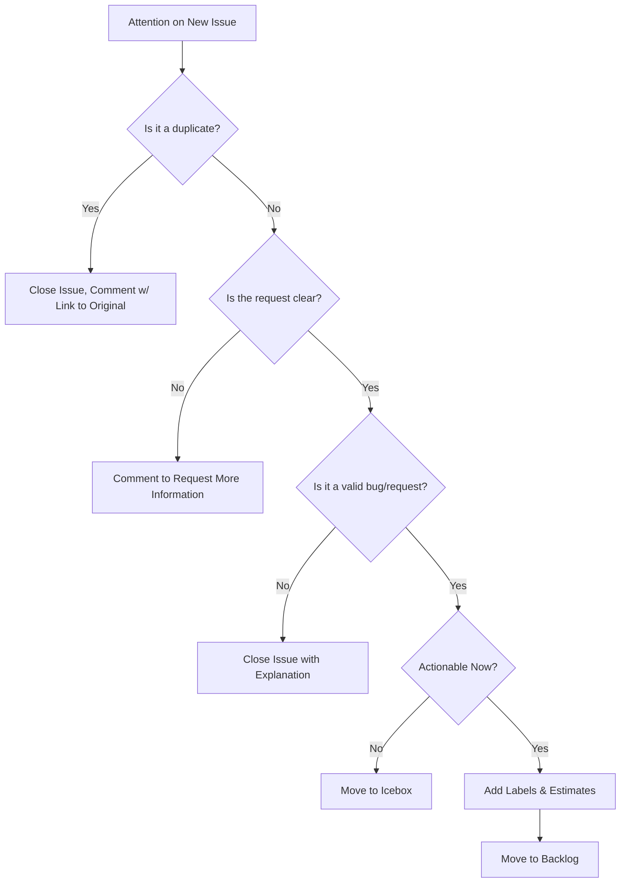
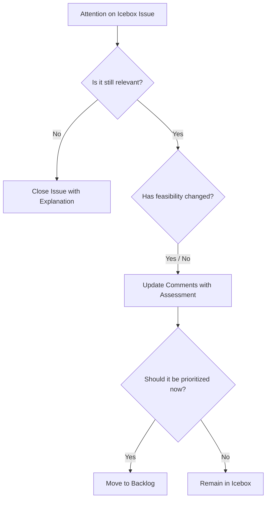
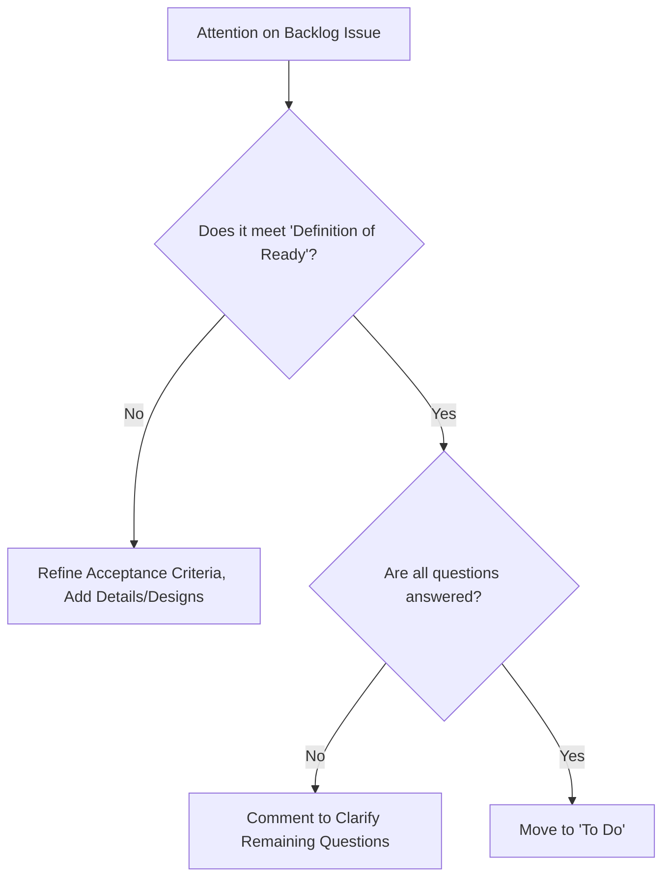
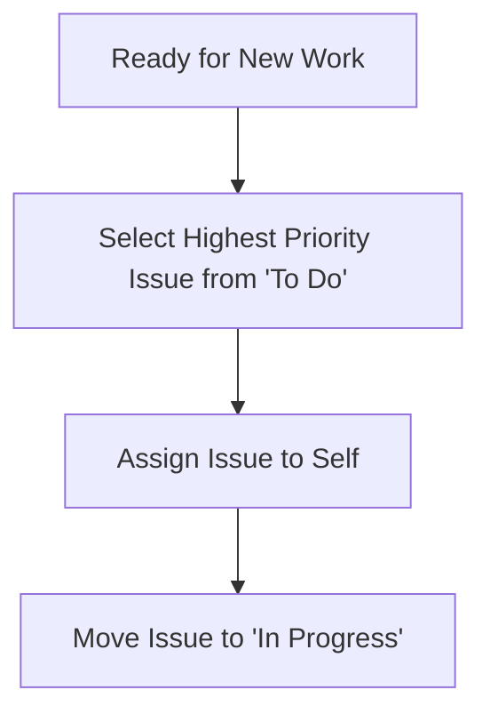

# Kanban CI/CD Workflow Specification

## 1. Overview

This document specifies the end-to-end workflow for managing issues within a Kanban system, from initial creation through to deployment. An "issue" represents any single unit of work, such as a feature, bug fix, or enhancement.

The flow is designed to ensure that work is properly vetted, prioritized, and developed with high quality, leveraging automation wherever possible. Each lane in the Kanban board has a distinct purpose and a defined set of actions to guide the process.

## 2. Project Setup and Automation

To implement this workflow effectively in a tool like GitHub, specific setup is required for the repository and its associated project board. This section outlines the necessary labels, board configuration, and automation rules that enable the workflow.

### 2.1. Label Conventions

A consistent labeling strategy is crucial for categorization and automation.

**Status Labels:**
These labels directly correspond to the lanes on the Kanban board and drive the automation. The `status:` prefix is used for clarity and to easily target these labels in scripts.

* `status:new-issue`
* `status:icebox`
* `status:backlog`
* `status:to-do`
* `status:in-progress`
* `status:code-review`
* `status:testing`
* `status:ready-for-deployment`
* `status:deployed`

**Type Labels:**
These labels provide metadata about the nature of the work.

* `type:bug`
* `type:feature`
* `type:enhancement`
* `type:tech-debt`
* `type:epic`

### 2.2. Project Board Configuration

The project board is the visual representation of this workflow.

1. Create a new Project and select the **Board** layout.
2. Configure the board's columns to be grouped by a custom field. Create a new **Single select** field named `Status`.
3. Add options to the `Status` field that exactly match the names of the workflow lanes (e.g., "New Issues", "Icebox", "In Progress", etc.). This links the visual columns to a data field on the issue.

### 2.3. Automation Workflows

To ensure dragging cards and changing labels are always in sync, two key automations should be implemented.

**Workflow 1: Lane Change Updates Label**
This ensures that manually dragging a card on the board updates the corresponding issue's label.

* **Trigger:** An item's `Status` field is changed within the project (this happens when a card is dragged to a new column).
* **Action:**
  1. Remove any existing `status:*` labels from the corresponding issue.
  2. Add the new `status:` label that matches the new column name (e.g., moving to the "In Progress" column adds the `status:in-progress` label).
* **Note:** This is often a built-in, configurable automation in modern project management tools like GitHub Projects.

**Workflow 2: Label Change Updates Lane**
This allows for updating an issue's status from anywhere (e.g., the issue page, a script) by simply changing its label.

* **Trigger:** A label with the prefix `status:` is added to an issue that is part of the project.
* **Action:**
  1. Update the issue's `Status` field in the project to match the name of the added label (e.g., adding the `status:code-review` label sets the `Status` field to "Code Review", automatically moving the card).
* **Note:** This typically requires a custom workflow, such as a GitHub Actions YAML file.

### 2.4. Implementation Examples (GitHub CLI & Actions)

Here are the commands and workflows to set up the project as described.

**1. Create Repository**
```
gh repo create my-new-project --public --description "A project following the Kanban CI/CD spec"
cd my-new-project
```

**2. Create Labels**
```
# Status Labels
gh label create "status:new-issue" --color "#a2eeef" --description "A new, untriaged issue."
gh label create "status:icebox" --color "#d876e3" --description "Valid issue, but not a current priority."
gh label create "status:backlog" --color "#bfd4f2" --description "Prioritized and ready for consideration."
gh label create "status:to-do" --color "#fef2c0" --description "Ready for active development."
gh label create "status:in-progress" --color "#2a9d8f" --description "Actively being worked on."
gh label create "status:code-review" --color "#f4a261" --description "Pull request is open and awaiting review."
gh label create "status:testing" --color "#e9c46a" --description "In QA, undergoing automated/manual tests."
gh label create "status:ready-for-deployment" --color "#6a48d9" --description "Passed all checks and is ready to be released."
gh label create "status:deployed" --color "#4CAF50" --description "Work is live in production."

# Type Labels
gh label create "type:bug" --color "#d73a4a" --description "An error or unintended behavior."
gh label create "type:feature" --color "#0075ca" --description "A request for new functionality."
gh label create "type:enhancement" --color "#a2eeef" --description "An improvement to an existing feature."
gh label create "type:tech-debt" --color "#7057ff" --description "Necessary refactoring or infrastructure work."
gh label create "type:epic" --color "#d876e3" --description "A large body of work."
```

**3. Create and Configure Project**
*Replace `YOUR_USERNAME` with your GitHub username or organization. After creating the project, note its number from the URL for the next step.*
```
# Create the project
gh project create --owner "YOUR_USERNAME" --title "My Project Board"

# Create the "Status" field with all its options (replace YOUR_PROJECT_NUMBER)
gh project field-create YOUR_PROJECT_NUMBER --owner "YOUR_USERNAME" --name "Status" \
--data-type "SINGLE_SELECT" \
--single-select-options "New Issues,Icebox,Backlog,To Do,In Progress,Code Review,Testing,Ready for Deployment,Deployed"
```

**4. Automation Workflow: Label to Lane**
Create a file at `.github/workflows/label-to-status.yml` to handle `Workflow 2`.
*Replace `YOUR_PROJECT_NUMBER` with your project's number.*
```
# .github/workflows/label-to-status.yml
name: Sync Label to Project Status

on:
  issues:
    types: [labeled]

jobs:
  sync:
    runs-on: ubuntu-latest
    steps:
      - name: Sync issue status when 'status:' label is added
        if: startsWith(github.event.label.name, 'status:')
        env:
          GH_TOKEN: ${{ secrets.GITHUB_TOKEN }}
          ORGANIZATION: ${{ github.repository_owner }}
          PROJECT_NUMBER: YOUR_PROJECT_NUMBER # Replace with your project number
          ISSUE_NODE_ID: ${{ github.event.issue.node_id }}
          STATUS_LABEL: ${{ github.event.label.name }}
        run: |
          # Extract the status name from the label, e.g., "status:in-progress" -> "In Progress"
          STATUS_VALUE=$(echo "$STATUS_LABEL" | sed -e 's/status://g' -e 's/-/ /g' -e 's/\b\(.\)/\u\1/g')

          # Get the Project and Status Field IDs
          gh api graphql -f query='
            query($org: String!, $number: Int!) {
              organization(login: $org){
                projectV2(number: $number) {
                  id
                  fields(first: 20) {
                    nodes {
                      ... on ProjectV2SingleSelectField {
                        id
                        name
                        options {
                          id
                          name
                        }
                      }
                    }
                  }
                }
              }
            }' -f org=$ORGANIZATION -f number=$PROJECT_NUMBER > project_data.json

          PROJECT_ID=$(jq -r '.data.organization.projectV2.id' project_data.json)
          STATUS_FIELD_ID=$(jq -r '.data.organization.projectV2.fields.nodes[] | select(.name=="Status") | .id' project_data.json)
          STATUS_OPTION_ID=$(jq -r --arg v "$STATUS_VALUE" '.data.organization.projectV2.fields.nodes[] | select(.name=="Status") | .options[] | select(.name==$v) | .id' project_data.json)

          # Get the Project Item ID
          ITEM_ID=$(gh api graphql -f query='
            query($node_id: ID!){
              node(id: $node_id) {
                ... on Issue {
                  projectItems(first: 10) {
                    nodes{
                      id
                    }
                  }
                }
              }
            }' -f node_id=$ISSUE_NODE_ID | jq -r '.data.node.projectItems.nodes[0].id')


          # Update the item's status field
          gh project item-edit \
            --id "$ITEM_ID" \
            --project-id "$PROJECT_ID" \
            --field-id "$STATUS_FIELD_ID" \
            --single-select-option-id "$STATUS_OPTION_ID"
```

## 3. Triage Lanes

Triage lanes are used to process, evaluate, and prioritize incoming work before it is committed to active development.

### 3.1. New Issues

This is the single entry point for all new work. The primary goal here is to perform initial triage, ensuring the issue is valid, clear, and actionable.


### 3.2. Icebox

This lane holds valid issues that are not a priority for the immediate future. It prevents backlog clutter while retaining potentially valuable ideas.


### 3.3. Backlog

This is the prioritized list of work that has been vetted and is ready for development consideration. The goal is to refine the items at the top of the backlog to ensure they are fully ready to be worked on.


## 4. Development & CI/CD Lanes

These lanes represent the active workflow for developing, testing, and deploying an issue.

### 4.1. To Do / Ready for Dev

This lane contains fully refined and prioritized issues that are ready for a developer to begin working on.


### 4.2. In Progress

This is the active development stage. The goal is to write high-quality code, create corresponding tests, and prepare the work for a peer review.
```mermaid
graph TD
    A[Issue in 'In Progress'] --> B[Create New Feature Branch from `main`];
    B --> C[Write Code & Corresponding Unit/Integration Tests];
    C --> D{Does code pass all local tests?};
    D -- No --> C;
    D -- Yes --> E[Commit & Push Feature Branch];
    E --> F[Open a Pull Request (PR)];
    F --> G[Link PR to Issue];
    G --> H[Move Issue to 'Code Review'];
```

### 4.3. Code Review

The submitted Pull Request (PR) is reviewed by peers. The goal is to ensure code quality, correctness, and adherence to team standards before it is merged.
```mermaid
graph TD
    A[Attention on PR for Review] --> B[Review Code for Quality & Logic];
    B -- C{Are changes required?};
    C -- Yes --> D[Request Changes in PR];
    D -- Yes --> E[Move Issue back to 'In Progress'];
    C -- No --> F[Approve Pull Request];
    F --> G[Merge PR into `main` branch];
    G --> H[Automated CI Pipeline Triggered];
    H --> I[Move Issue to 'Testing'];
```

### 4.4. Testing (QA)

The CI (Continuous Integration) pipeline automatically builds and tests the merged code. The goal is to catch any integration errors or regressions before deployment.
```mermaid
graph TD
    A[CI Pipeline Running] --> B[Build & Run All Automated Tests];
    B -- C{Did all tests pass?};
    C -- No --> D[Alert Development Team];
    D -- E --> F[Create New Bug Issue];
    E --> G[Revert Merge / Fix Forward];
    G --> H[Move Original Issue back to 'In Progress'];
    C -- Yes --> I[Move Issue to 'Ready for Deployment'];
```

### 4.5. Ready for Deployment

The code has passed all automated checks and is staged to be released to the production environment.
```mermaid
graph TD
    A[Issue is 'Ready for Deployment'] --> B{Is deployment automated (CD)?};
    B -- Yes --> C[Automated Deployment Script Runs];
    B -- No --> D[Manually Trigger Deployment];
    D --> C;
    C --> E[Push Build to Production];
    E --> F[Move Issue to 'Deployed'];
```

### 4.6. Deployed

The work is now live in production. The final goal is to monitor for any unexpected issues resulting from the change.
```mermaid
graph TD
    A[Issue is 'Deployed'] --> B[Monitor Logs & Performance Metrics];
    B --> C{Any new errors or bugs?};
    C -- Yes --> D[Create New 'Bug' Issue];
    D --> E[Link to original issue];
    C -- No --> F[Work is Complete. Celebrate! ✨];
