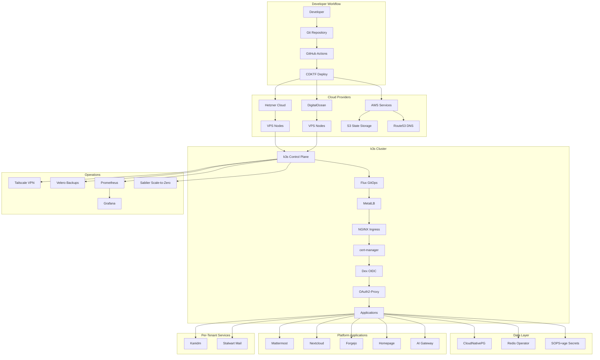

# Architecture Overview

This document provides a comprehensive overview of the k3s multicloud GitOps infrastructure architecture, detailing the system components, their responsibilities, and how they interact.

## System Architecture

### High-Level Overview



### Design Principles

- **Multicloud portability**: Infrastructure runs on any VPS provider (Hetzner, DigitalOcean, or others) rather than being locked to a managed Kubernetes service.
- **GitOps-first**: All cluster state is declarative and version-controlled. Flux reconciles the desired state from Git.
- **Secrets in Git**: Encrypted with SOPS+age, secrets live alongside manifests and are decrypted at deploy time by Flux.
- **Multi-tenancy**: Per-organization namespaces with dedicated Kanidm identity and Stalwart Mail instances.
- **Cost efficiency**: k3s on bare VPS nodes avoids managed Kubernetes premiums. Sablier provides scale-to-zero for idle workloads.

## Infrastructure as Code (CDKTF)

### CDKTF Stack Architecture

The platform uses **Terraform CDK (CDKTF)** with TypeScript for type-safe, multicloud infrastructure provisioning.

- **Type Safety**: Compile-time validation of infrastructure configurations
- **Multicloud Support**: Provider abstractions for Hetzner Cloud and DigitalOcean
- **Code Reuse**: Shared constructs and modules across environments
- **IDE Support**: Full IntelliSense and debugging capabilities

### Core CDKTF Stacks

#### VPS Provisioning Stack
Provisions compute nodes on the target cloud provider (Hetzner or DigitalOcean). Creates VPS instances with appropriate sizing, SSH keys, and firewall rules. Outputs node IPs for k3s installation.

#### DNS Stack
Manages DNS zones and records via AWS Route53. Configures wildcard records and provider-specific entries for External-DNS integration.

#### State Storage Stack
Creates and manages the AWS S3 bucket used for Terraform state storage with versioning and encryption enabled.

## Cluster Runtime (k3s)

k3s is a lightweight, certified Kubernetes distribution that runs directly on VPS nodes without requiring a managed Kubernetes service.

### Key Characteristics

- **Single-binary deployment**: Installs as a single binary on each node
- **Embedded components**: Includes containerd, CoreDNS, local-path provisioner, and Traefik (Traefik is disabled in favor of NGINX Ingress)
- **Low resource overhead**: Suitable for smaller VPS instances
- **Built-in local-path provisioner**: Default storage class using local node storage

### Storage

The cluster uses the **local-path provisioner** included with k3s as the default StorageClass. Persistent volumes are provisioned on the local filesystem of each node. This avoids dependency on cloud-specific block storage drivers.

For workloads requiring durability beyond a single node, data replication is handled at the application level (CloudNativePG replication, Redis replication) and through Velero backups.

## Networking

### MetalLB

MetalLB provides bare-metal load balancing for k3s clusters running on VPS nodes. It assigns external IPs to LoadBalancer-type Services, enabling NGINX Ingress to receive traffic.

### NGINX Ingress Controller

NGINX Ingress Controller handles all HTTP/HTTPS traffic routing. It replaces the previous Kong Gateway setup with a simpler, widely-adopted ingress solution.

- **Ingress resources**: Standard Kubernetes Ingress objects for routing
- **TLS termination**: Automatic certificate injection from cert-manager
- **Rate limiting**: Annotation-based rate limiting per Ingress
- **Proxy configuration**: Configurable timeouts, body sizes, and header handling

### cert-manager

cert-manager automates TLS certificate issuance and renewal using Let's Encrypt. Certificates are provisioned via DNS-01 challenges through Route53.

### External-DNS

External-DNS automatically manages DNS records in AWS Route53 based on Ingress and Service resources in the cluster. When an Ingress is created with a hostname, External-DNS creates the corresponding A/CNAME record.

### Tailscale Operator

The Tailscale Operator provides mesh VPN connectivity between cluster nodes and administrative access. It enables secure access to cluster services without exposing them to the public internet.

## Identity and Authentication

### Dex OIDC Provider

Dex serves as the central OIDC identity provider for all platform-level applications. It federates identity from upstream sources and provides a unified authentication interface.

- **OIDC/OAuth2 standard**: All apps authenticate through standard OIDC flows
- **Connector-based**: Supports multiple upstream identity sources
- **Static clients**: Each application is registered as a Dex client
- **Lightweight**: Minimal resource footprint compared to full identity platforms

### OAuth2-Proxy

OAuth2-Proxy provides authentication enforcement for applications that do not have native OIDC support. It sits in front of the application as an Ingress auth sub-request handler.

### Per-Tenant Kanidm

Kanidm is deployed per-tenant (per-organization namespace) as a dedicated identity provider. Each tenant gets their own Kanidm instance for user and group management, providing strong identity isolation between organizations.

## Secret Management (SOPS+age)

Secrets are encrypted at rest in the Git repository using SOPS with age encryption. This approach keeps secrets alongside the manifests they belong to, versioned and auditable through Git history.

- **Encryption**: age public key encrypts; private key stays on cluster
- **Decryption**: Flux Kustomization controller decrypts at reconciliation time
- **File patterns**: `*.secret.enc.yaml` for encrypted files, `*.secret.template.yaml` for structure documentation
- **No external dependencies**: No external secret store infrastructure required

See [SECRETS.md](SECRETS.md) for detailed setup and usage instructions.

## Database Architecture (CloudNativePG)

CloudNativePG manages high-availability PostgreSQL clusters as native Kubernetes resources.

### Features

- **Declarative clusters**: PostgreSQL clusters defined as Kubernetes custom resources
- **Automatic failover**: Leader election and automatic promotion of replicas
- **Point-in-time recovery**: Continuous WAL archiving for disaster recovery
- **Rolling updates**: Zero-downtime PostgreSQL version upgrades
- **Connection pooling**: Built-in PgBouncer integration
- **Monitoring**: Prometheus metrics exported automatically

### Per-Application Databases

Each application that requires PostgreSQL (Mattermost, Nextcloud, Forgejo, Kanidm) gets a dedicated CloudNativePG Cluster resource with its own storage, backup, and replication configuration.

## Caching (OpsTree Redis Operator)

The OpsTree Redis Operator manages Redis instances for applications that require caching or session storage (Nextcloud, Mattermost).

- **Operator-managed**: Redis instances declared as Kubernetes custom resources
- **Replication**: Configurable primary-replica setups
- **Monitoring**: Prometheus metrics integration

## Monitoring

### Prometheus

Prometheus collects metrics from all cluster components and applications via ServiceMonitor and PodMonitor resources. It provides the metrics backend for alerting and dashboards.

### Grafana

Grafana provides visualization dashboards for cluster health, application metrics, and resource utilization. It connects to Prometheus as its primary data source and is protected by Dex OIDC authentication.

Prometheus and Grafana are deployed as separate stacks to allow independent lifecycle management and resource allocation.

## Backups (Velero)

Velero provides cluster-level backup and restore capabilities.

- **Scheduled backups**: Automatic periodic backups of cluster resources and persistent volumes
- **Disaster recovery**: Full cluster restore from backup
- **Selective restore**: Restore specific namespaces or resources
- **Object storage backend**: Backups stored in S3-compatible storage

## Scale-to-Zero (Sablier)

Sablier enables scale-to-zero for idle workloads, reducing resource consumption and cost for infrequently accessed services. When a request arrives for a scaled-down service, Sablier starts the workload and serves a loading page until the service is ready.

## Multi-Tenancy Model

The platform supports multi-tenancy through per-organization Kubernetes namespaces.

### Per-Tenant Resources

Each tenant (organization) receives:
- **Dedicated namespace**: Resource isolation and RBAC boundaries
- **Kanidm instance**: Tenant-specific identity provider for users and groups
- **Stalwart Mail instance**: Tenant-specific email server
- **Resource quotas**: Configurable CPU, memory, and storage limits

### Shared Platform Services

All tenants share:
- **NGINX Ingress**: Common ingress layer with tenant-specific hostnames
- **Dex OIDC**: Platform-level authentication (can federate to per-tenant Kanidm)
- **CloudNativePG operator**: Shared operator, per-tenant database clusters
- **Monitoring stack**: Centralized Prometheus and Grafana with namespace filtering

## Flux Dependency Chain

Flux Kustomizations are ordered with explicit dependencies to ensure components start in the correct sequence:

```
MetalLB
  -> NGINX Ingress Controller
    -> cert-manager
      -> Dex OIDC Provider
        -> OAuth2-Proxy
          -> Applications (Mattermost, Nextcloud, Forgejo, Homepage, AI Gateway)
          -> Per-Tenant Services (Kanidm, Stalwart Mail)
```

Each layer waits for the previous layer to be healthy before reconciling. This ensures, for example, that certificates cannot be issued before cert-manager is running, and applications cannot authenticate before Dex is available.

## DNS Structure

All DNS is managed through AWS Route53 via External-DNS. The standard subdomain pattern is:

| Subdomain | Application |
|-----------|-------------|
| `chat.DOMAIN` | Mattermost |
| `cloud.DOMAIN` | Nextcloud |
| `git.DOMAIN` | Forgejo |
| `home.DOMAIN` | Homepage |
| `ai.DOMAIN` | AI Gateway / LiteLLM |
| `dex.DOMAIN` | Dex OIDC |
| `grafana.DOMAIN` | Grafana |
| `prometheus.DOMAIN` | Prometheus |

Per-tenant services use tenant-prefixed subdomains (e.g., `id.tenant.DOMAIN` for Kanidm, `mail.tenant.DOMAIN` for Stalwart Mail).

## Security Architecture

### Network Security

- **Tailscale mesh VPN**: Encrypted node-to-node and admin-to-cluster communication
- **Network Policies**: Pod-to-pod communication control within namespaces
- **TLS everywhere**: cert-manager ensures all ingress traffic is encrypted
- **Firewall rules**: Cloud provider firewalls restrict access to cluster nodes

### Identity and Access Management

- **RBAC**: Kubernetes role-based access control per namespace
- **OIDC authentication**: Centralized authentication via Dex
- **Per-tenant isolation**: Kanidm provides tenant-level identity boundaries
- **Service accounts**: Least privilege principle for all workloads

### Secrets Security

- **Encrypted in Git**: SOPS+age encryption for all secrets at rest
- **Decrypted at runtime**: Flux decrypts secrets only during reconciliation
- **Key management**: age private key stored as a single Kubernetes secret in flux-system namespace
- **Auditability**: Secret changes tracked through Git history
