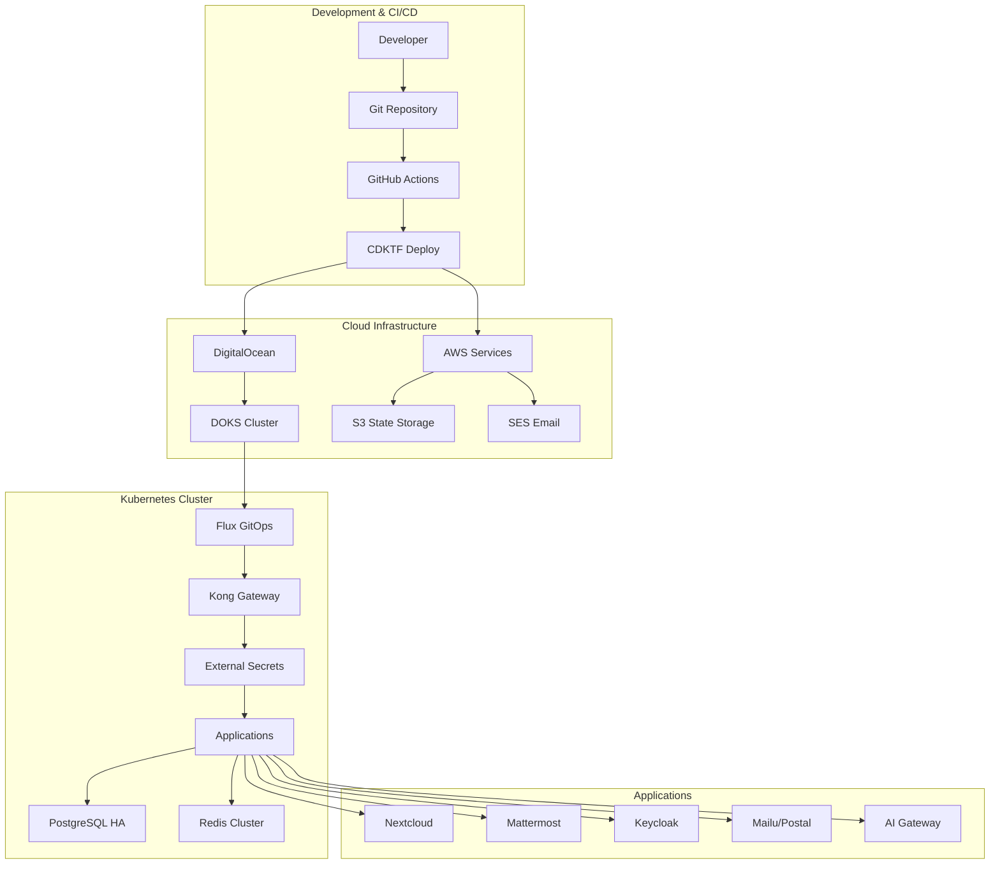

# Architecture Overview

This document provides a comprehensive overview of the enterprise-grade GitOps template architecture, detailing the sophisticated infrastructure components and their interactions.

## System Architecture

### High-Level Overview



## Infrastructure as Code (CDKTF)

### CDKTF Stack Architecture

The template uses **Terraform CDK (CDKTF)** with TypeScript for type-safe infrastructure provisioning. This provides:

- **Type Safety**: Compile-time validation of infrastructure configurations
- **Code Reuse**: Shared constructs and modules across environments
- **Testing**: Unit and integration testing of infrastructure code
- **IDE Support**: Full IntelliSense and debugging capabilities

### Core CDKTF Stacks

#### 1. DigitalOceanClusterStack
**Purpose**: Provisions the Kubernetes cluster infrastructure

**Components**:
- **DOKS Cluster**: High-availability Kubernetes cluster
- **Node Pools**: Configurable worker nodes with auto-scaling
- **VPC Integration**: Network isolation and security
- **Load Balancer**: Managed load balancer for ingress traffic

**Configuration**:
```typescript
{
  cluster: {
    region: "nyc3",
    nodeSize: "s-4vcpu-8gb",
    nodeCount: 3,
    haControlPlane: true,
    version: "1.31.0"
  }
}
```

#### 2. DigitalOceanSpacesStack
**Purpose**: Object storage for applications (not Terraform state)

**Components**:
- **Primary Storage**: Nextcloud uses Spaces as primary storage
- **Backup Storage**: Application backups and media storage
- **CDN Integration**: Global content delivery
- **Access Control**: Fine-grained permissions and CORS

**Features**:
- S3-compatible API for application integration
- Automatic backup retention policies
- Cross-region replication options

#### 3. AWSSESStack
**Purpose**: Enterprise email infrastructure

**Components**:
- **SES Service**: Reliable email delivery
- **SMTP Credentials**: Application email integration
- **Domain Verification**: SPF, DKIM, DMARC configuration
- **Bounce Handling**: Automated bounce and complaint processing

**Integration**:
- Mailu and Postal email servers use SES for relay
- Application notifications and alerts
- User registration and password reset emails

#### 4. GitHubSecretsStack
**Purpose**: Automated secret management and repository configuration

**Components**:
- **Secret Injection**: Automated GitHub repository secret creation
- **Credential Management**: Service account and API key management
- **Workflow Integration**: Secrets available to GitHub Actions
- **Security**: Encrypted secret storage and access control

#### 5. FluxConfigurationStack
**Purpose**: GitOps bootstrap and configuration

**Components**:
- **Flux Installation**: GitOps operator deployment
- **Git Integration**: Repository monitoring and sync
- **Kustomization**: Application and infrastructure overlays
- **RBAC**: Flux service account and permissions

## API Gateway (Kong)

### Kong Gateway Architecture

The template uses **Kong Gateway** instead of traditional ingress controllers, providing enterprise-grade API gateway functionality.

### Key Features

#### Gateway API Integration
- **Modern Networking**: Uses Kubernetes Gateway API instead of legacy Ingress
- **HTTPRoute Resources**: Advanced routing with path, header, and method matching
- **TLS Termination**: Automatic SSL/TLS with cert-manager integration
- **Load Balancing**: Sophisticated traffic distribution algorithms

#### OIDC Authentication
- **Keycloak Integration**: Single sign-on across all applications
- **JWT Validation**: Token-based authentication and authorization
- **Session Management**: Redis-backed distributed sessions
- **Role-Based Access**: Fine-grained permission control

#### Advanced Routing
```yaml
apiVersion: gateway.networking.k8s.io/v1beta1
kind: HTTPRoute
metadata:
  name: nextcloud
spec:
  rules:
  - matches:
    - path:
        type: PathPrefix
        value: /
    filters:
    - type: ExtensionRef
      extensionRef:
        group: configuration.konghq.com
        kind: KongPlugin
        name: oidc-auth
```

#### Monitoring and Observability
- **Prometheus Metrics**: Comprehensive API metrics
- **Request Tracing**: Distributed tracing integration
- **Rate Limiting**: Protection against abuse and DDoS
- **Analytics**: Traffic patterns and performance insights

## Secret Management (External Secrets Operator)

### External Secrets Architecture

The template implements **External Secrets Operator (ESO)** for dynamic secret management, replacing traditional GitOps-encrypted secrets.

### Key Components

#### Secret Stores
**GitHub Backend**:
```yaml
apiVersion: external-secrets.io/v1beta1
kind: SecretStore
metadata:
  name: github-secret-store
spec:
  provider:
    github:
      owner: "organization"
      repo: "repository"
      auth:
        token:
          secretRef:
            name: github-token
            key: token
```

**AWS Secrets Manager Backend**:
```yaml
apiVersion: external-secrets.io/v1beta1
kind: SecretStore
metadata:
  name: aws-secret-store
spec:
  provider:
    aws:
      service: SecretsManager
      region: us-east-1
      auth:
        secretRef:
          accessKeyIDSecretRef:
            name: aws-credentials
            key: access-key-id
```

#### External Secrets
Dynamic secret injection for applications:
```yaml
apiVersion: external-secrets.io/v1beta1
kind: ExternalSecret
metadata:
  name: nextcloud-secrets
spec:
  secretStoreRef:
    name: github-secret-store
    kind: SecretStore
  target:
    name: nextcloud-secrets
    creationPolicy: Owner
  data:
  - secretKey: database-password
    remoteRef:
      key: NEXTCLOUD_DATABASE_PASSWORD
  - secretKey: admin-password
    remoteRef:
      key: NEXTCLOUD_ADMIN_PASSWORD
```

### Security Benefits

1. **No Secrets in Git**: Secrets never stored in repository
2. **Runtime Fetching**: Secrets fetched when needed
3. **Automatic Rotation**: Supports secret rotation workflows
4. **Audit Trail**: Complete access logging and monitoring
5. **Least Privilege**: Fine-grained access control per application

## Database Architecture (CloudNativePG)

### High-Availability PostgreSQL

The template deploys **CloudNativePG** for enterprise-grade database management.

### Cluster Configuration

#### Primary-Replica Setup
```yaml
apiVersion: postgresql.cnpg.io/v1
kind: Cluster
metadata:
  name: nextcloud-postgres
spec:
  instances: 3
  
  postgresql:
    parameters:
      max_connections: "200"
      shared_buffers: "256MB"
      effective_cache_size: "1GB"
      
  storage:
    size: "100Gi"
    storageClass: "do-block-storage"
    
  monitoring:
    enabled: true
    
  backup:
    retentionPolicy: "30d"
    data:
      destination: "s3"
      s3:
        bucket: "cluster-backups"
        path: "/postgresql"
```

### Features

1. **Automatic Failover**: Leader election and failover automation
2. **Point-in-Time Recovery**: Continuous WAL archiving
3. **Rolling Updates**: Zero-downtime PostgreSQL updates
4. **Connection Pooling**: Built-in PgBouncer for connection management
5. **Monitoring**: Prometheus metrics and Grafana dashboards

## Application Integration

### OIDC Integration Pattern

All applications integrate with Keycloak for single sign-on:

#### Nextcloud
- **Primary Storage**: DigitalOcean Spaces (not local storage)
- **Database**: CloudNativePG cluster with 3 replicas
- **Authentication**: Keycloak OIDC with group mapping
- **High Availability**: Multiple pod replicas with shared storage

#### Mattermost
- **Team Collaboration**: Enterprise messaging platform
- **SSO Integration**: Keycloak OIDC for user authentication
- **Database**: Dedicated PostgreSQL cluster
- **File Storage**: DigitalOcean Spaces for attachments

#### Keycloak
- **Identity Provider**: Central authentication service
- **Operator Managed**: Keycloak Operator for lifecycle management
- **Realm Configuration**: Automated client and user setup
- **Database**: High-availability PostgreSQL backend

#### Email Services (Mailu/Postal)
- **SMTP Relay**: AWS SES integration for reliable delivery
- **OAuth2 Proxy**: OIDC authentication for webmail access
- **Anti-Spam**: Advanced filtering and reputation management
- **Database**: PostgreSQL for user and domain management

### Storage Architecture

#### Primary Storage Strategy
- **Applications**: DigitalOcean Spaces as primary storage
- **Databases**: High-performance SSD block storage
- **Backups**: Automated backups to separate Spaces bucket
- **Terraform State**: AWS S3 with versioning and encryption

#### Storage Classes
```yaml
# High-performance SSD for databases
apiVersion: storage.k8s.io/v1
kind: StorageClass
metadata:
  name: fast-ssd
provisioner: dobs.csi.digitalocean.com
parameters:
  type: "ssd"
  
# Standard storage for general use
apiVersion: storage.k8s.io/v1
kind: StorageClass
metadata:
  name: standard
provisioner: dobs.csi.digitalocean.com
parameters:
  type: "standard"
```

## Monitoring and Observability

### Prometheus Stack
- **Metrics Collection**: Application and infrastructure metrics
- **Alerting**: Proactive notification of issues
- **Grafana Dashboards**: Visual monitoring and analytics
- **ServiceMonitors**: Automatic service discovery and scraping

### Logging Architecture
- **Centralized Logging**: ELK or similar stack for log aggregation
- **Application Logs**: Structured logging with correlation IDs
- **Audit Logs**: Security and compliance logging
- **Log Retention**: Configurable retention policies

## Backup and Disaster Recovery

### Velero Integration
- **Cluster Backups**: Complete cluster state backups
- **Application Data**: Persistent volume backups
- **Cross-Region**: Backup to separate geographic region
- **Automated Scheduling**: Regular backup schedules

### Recovery Procedures
1. **Infrastructure Recovery**: CDKTF re-deployment
2. **Cluster Recovery**: Velero cluster restore
3. **Database Recovery**: CloudNativePG point-in-time recovery
4. **Application Recovery**: GitOps re-sync and external secret restoration

## Security Architecture

### Network Security
- **VPC Isolation**: Private network for cluster nodes
- **Network Policies**: Pod-to-pod communication control
- **TLS Everywhere**: End-to-end encryption
- **Certificate Management**: Automated cert-manager integration

### Identity and Access Management
- **RBAC**: Kubernetes role-based access control
- **Service Accounts**: Least privilege principle
- **OIDC Integration**: Centralized authentication
- **API Security**: Kong Gateway security plugins

### Secrets Security
- **External Secrets**: No secrets in Git repository
- **Encryption at Rest**: Secret encryption in external stores
- **Access Auditing**: Complete secret access logging
- **Rotation Policies**: Automated secret rotation

This architecture provides a robust, scalable, and secure foundation for enterprise applications while maintaining the flexibility and automation benefits of GitOps workflows.