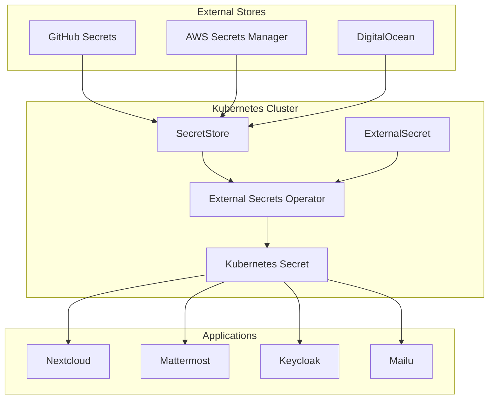

# Secret Management Guide

This guide covers the Enterprise GitOps template's advanced secret management using External Secrets Operator (ESO), replacing traditional GitOps-encrypted approaches for improved security and operational efficiency.

## Overview

The template implements **External Secrets Operator (ESO)** for enterprise-grade secret management with these key principles:

- **No Secrets in Git**: Secrets never stored in repository, even encrypted
- **Dynamic Injection**: Secrets fetched at runtime from external stores
- **Multiple Backends**: Support for GitHub, AWS, DigitalOcean, and other providers
- **Automatic Rotation**: Built-in support for secret rotation workflows
- **Kubernetes Native**: Seamless integration with RBAC and namespaces

## Architecture

### External Secrets Operator Components



### Core Components

#### 1. External Secrets Operator
The central controller that:
- Monitors ExternalSecret resources
- Fetches secrets from external stores
- Creates and updates Kubernetes secrets
- Handles authentication and authorization

#### 2. SecretStore / ClusterSecretStore
Defines connections to external secret backends:
- **SecretStore**: Namespace-scoped
- **ClusterSecretStore**: Cluster-scoped (used by this template)

#### 3. ExternalSecret
Specifies which secrets to fetch and how to map them to Kubernetes secrets.

## Secret Stores Configuration

### GitHub Secrets Backend

GitHub repository secrets serve as the primary external secret store:

```yaml
apiVersion: external-secrets.io/v1beta1
kind: ClusterSecretStore
metadata:
  name: github-secret-store
spec:
  provider:
    github:
      owner: "your-organization"
      repo: "your-repository"
      auth:
        token:
          secretRef:
            name: github-token
            key: token
            namespace: external-secrets-system
```

#### GitHub Integration Benefits:
- **Built-in Encryption**: GitHub secrets encrypted at rest
- **Access Control**: Repository-level permissions
- **Audit Trail**: Complete access logging
- **No Additional Infrastructure**: Uses existing GitHub account

### AWS Secrets Manager Backend

For advanced secret management and rotation:

```yaml
apiVersion: external-secrets.io/v1beta1
kind: ClusterSecretStore
metadata:
  name: aws-secret-store
spec:
  provider:
    aws:
      service: SecretsManager
      region: us-east-1
      auth:
        secretRef:
          accessKeyIDSecretRef:
            name: aws-credentials
            key: access-key-id
            namespace: external-secrets-system
          secretAccessKeySecretRef:
            name: aws-credentials
            key: secret-access-key
            namespace: external-secrets-system
```

#### AWS Integration Benefits:
- **Automatic Rotation**: Built-in rotation for database credentials
- **Fine-grained IAM**: Precise access control
- **Encryption**: KMS integration for encryption
- **Cross-region**: Multi-region secret replication

### DigitalOcean Secrets (Future)

While not yet implemented, DigitalOcean secrets integration is planned:

```yaml
apiVersion: external-secrets.io/v1beta1
kind: ClusterSecretStore
metadata:
  name: digitalocean-secret-store
spec:
  provider:
    digitalocean:
      auth:
        token:
          secretRef:
            name: digitalocean-token
            key: token
            namespace: external-secrets-system
```

## External Secret Patterns

### Application Credentials

Each application uses ExternalSecret resources to fetch required credentials:

```yaml
apiVersion: external-secrets.io/v1beta1
kind: ExternalSecret
metadata:
  name: nextcloud-credentials
  namespace: nextcloud
spec:
  refreshInterval: 1h
  secretStoreRef:
    name: github-secret-store
    kind: ClusterSecretStore
  target:
    name: nextcloud-credentials
    creationPolicy: Owner
    template:
      type: Opaque
  data:
  - secretKey: admin-username
    remoteRef:
      key: NEXTCLOUD_ADMIN_USERNAME
  - secretKey: admin-password
    remoteRef:
      key: NEXTCLOUD_ADMIN_PASSWORD
  - secretKey: S3_ACCESS_KEY
    remoteRef:
      key: DIGITALOCEAN_SPACES_ACCESS_KEY
  - secretKey: S3_SECRET_KEY
    remoteRef:
      key: DIGITALOCEAN_SPACES_SECRET_KEY
  - secretKey: OIDC_CLIENT_SECRET
    remoteRef:
      key: NEXTCLOUD_OIDC_SECRET
```

### Database Credentials

Database credentials with automatic generation and rotation:

```yaml
apiVersion: external-secrets.io/v1beta1
kind: ExternalSecret
metadata:
  name: postgres-credentials
  namespace: nextcloud
spec:
  refreshInterval: 15m
  secretStoreRef:
    name: aws-secret-store
    kind: ClusterSecretStore
  target:
    name: postgres-credentials
    creationPolicy: Owner
  data:
  - secretKey: username
    remoteRef:
      key: /database/nextcloud
      property: username
  - secretKey: password
    remoteRef:
      key: /database/nextcloud
      property: password
```

### SMTP/Email Credentials

Email service credentials for application notifications:

```yaml
apiVersion: external-secrets.io/v1beta1
kind: ExternalSecret
metadata:
  name: smtp-credentials
  namespace: mattermost
spec:
  refreshInterval: 1h
  secretStoreRef:
    name: github-secret-store
    kind: ClusterSecretStore
  target:
    name: smtp-credentials
    creationPolicy: Owner
  data:
  - secretKey: smtp-username
    remoteRef:
      key: AWS_SES_SMTP_USERNAME
  - secretKey: smtp-password
    remoteRef:
      key: AWS_SES_SMTP_PASSWORD
```

## Secret Management Workflows

### Initial Setup Process

1. **Setup Script Execution**: `./setup.ts` creates initial secrets in GitHub repository
2. **Bootstrap Secrets**: ESO controller credentials and GitHub token
3. **Secret Store Creation**: ClusterSecretStore resources deployed via GitOps
4. **External Secret Deployment**: ExternalSecret resources created for applications
5. **Automatic Injection**: ESO fetches and creates Kubernetes secrets

### Secret Rotation Workflow

#### Automatic Rotation (AWS Secrets Manager)
```yaml
apiVersion: external-secrets.io/v1beta1
kind: ExternalSecret
metadata:
  name: database-credentials
spec:
  refreshInterval: 15m  # Check for updates every 15 minutes
  secretStoreRef:
    name: aws-secret-store
    kind: ClusterSecretStore
  target:
    name: database-credentials
    template:
      metadata:
        annotations:
          # Trigger rolling update when secret changes
          reloader.stakater.com/match: "true"
```

#### Manual Rotation (GitHub Secrets)
1. Update secret value in GitHub repository secrets
2. ESO automatically detects change within refresh interval
3. Kubernetes secret updated automatically
4. Applications restart if configured with secret reloader

### Emergency Secret Invalidation

For immediate secret invalidation:

```bash
# Delete the external secret (stops fetching)
kubectl delete externalsecret app-credentials -n app-namespace

# Update secret in external store
gh secret set APP_PASSWORD --body "new-password"

# Recreate external secret
kubectl apply -f external-secret.yaml

# Force immediate refresh
kubectl annotate externalsecret app-credentials force-sync=$(date +%s) -n app-namespace
```

## Security Best Practices

### Least Privilege Access

#### Secret Store RBAC
```yaml
apiVersion: rbac.authorization.k8s.io/v1
kind: ClusterRole
metadata:
  name: external-secrets-reader
rules:
- apiGroups: [""]
  resources: ["secrets"]
  verbs: ["get", "list", "watch", "create", "update", "patch"]
  resourceNames: ["github-token", "aws-credentials"]
```

#### Application-Specific Access
- Each application namespace has dedicated ExternalSecret resources
- Secrets only accessible within target namespace
- No cross-namespace secret access

### Secret Encryption

#### At Rest Encryption
- **GitHub**: GitHub-managed encryption for repository secrets
- **AWS**: KMS encryption for Secrets Manager
- **Kubernetes**: etcd encryption at rest

#### In Transit Encryption
- All communication to external stores uses TLS
- Kubernetes API communication encrypted
- Pod-to-secret access via encrypted connections

### Audit and Monitoring

#### Secret Access Monitoring
```yaml
apiVersion: monitoring.coreos.com/v1
kind: ServiceMonitor
metadata:
  name: external-secrets
spec:
  selector:
    matchLabels:
      app.kubernetes.io/name: external-secrets
  endpoints:
  - port: metrics
    path: /metrics
    interval: 30s
```

#### Audit Logging
- External Secrets Operator events logged
- Secret access patterns monitored
- Failed authentication attempts tracked
- GitHub API access logs available

## Secret Categories

### Infrastructure Secrets

| Secret Type | Location | Purpose | Rotation |
|-------------|----------|---------|----------|
| DigitalOcean API Token | GitHub | Cluster management | Manual |
| AWS Credentials | GitHub | S3, SES access | Manual |
| GitHub Token | Bootstrap | Repository access | Manual |
| Terraform State Access | AWS | State management | Automatic |

### Application Secrets

| Application | Secret Types | External Store | Rotation |
|-------------|--------------|----------------|----------|
| **Nextcloud** | Admin password, OIDC client, S3 keys | GitHub | Manual |
| **Mattermost** | Admin password, OIDC client, SMTP | GitHub | Manual |
| **Keycloak** | Admin password, database, SMTP | GitHub/AWS | Manual/Auto |
| **Mailu** | Admin password, secret key, SMTP relay | GitHub | Manual |

### Database Secrets

| Database | Credentials | Store | Rotation |
|----------|-------------|-------|----------|
| **PostgreSQL** | Admin username/password | AWS Secrets Manager | Automatic |
| **Redis** | Password | GitHub | Manual |
| **Application DBs** | User credentials | AWS Secrets Manager | Automatic |

## Operational Procedures

### Retrieving Secret Values

#### For Debugging (Admin Only)
```bash
# Get secret from Kubernetes
kubectl get secret app-credentials -n app-namespace -o yaml

# Decode secret value
kubectl get secret app-credentials -n app-namespace -o jsonpath='{.data.password}' | base64 -d

# Check external secret status
kubectl describe externalsecret app-credentials -n app-namespace
```

#### Using Admin Scripts
```bash
# Get admin password for Nextcloud
./scripts/get-admin-password.sh nextcloud

# Get database credentials
./scripts/get-admin-password.sh postgres

# Get Keycloak admin credentials
./scripts/get-admin-password.sh keycloak
```

### Adding New Secrets

#### 1. Add to External Store
```bash
# GitHub repository secret
gh secret set NEW_SECRET_VALUE --body "secret-value"

# AWS Secrets Manager
aws secretsmanager create-secret \
  --name "/app/new-secret" \
  --description "New application secret" \
  --secret-string "secret-value"
```

#### 2. Create ExternalSecret Resource
```yaml
apiVersion: external-secrets.io/v1beta1
kind: ExternalSecret
metadata:
  name: new-app-secret
  namespace: app-namespace
spec:
  refreshInterval: 1h
  secretStoreRef:
    name: github-secret-store
    kind: ClusterSecretStore
  target:
    name: new-app-secret
    creationPolicy: Owner
  data:
  - secretKey: secret-key
    remoteRef:
      key: NEW_SECRET_VALUE
```

#### 3. Update Application
Reference the new secret in application deployment:
```yaml
env:
- name: SECRET_VALUE
  valueFrom:
    secretKeyRef:
      name: new-app-secret
      key: secret-key
```

### Monitoring Secret Health

#### External Secret Status
```bash
# Check all external secrets
kubectl get externalsecrets --all-namespaces

# Check specific external secret
kubectl describe externalsecret app-credentials -n app-namespace

# Check secret store connectivity
kubectl describe clustersecretstore github-secret-store
```

#### Secret Synchronization Issues
```bash
# Check ESO controller logs
kubectl logs -n external-secrets-system deployment/external-secrets

# Force secret refresh
kubectl annotate externalsecret app-credentials \
  force-sync=$(date +%s) -n app-namespace

# Check secret events
kubectl get events -n app-namespace --field-selector involvedObject.name=app-credentials
```

## Migration from SOPS/Age

For repositories migrating from SOPS/Age to External Secrets Operator:

### Migration Steps

1. **Extract Current Secrets**: Decrypt existing SOPS-encrypted secrets
2. **Upload to External Store**: Add secrets to GitHub repository or AWS
3. **Deploy ESO**: Install External Secrets Operator
4. **Create Secret Stores**: Configure connections to external stores
5. **Deploy External Secrets**: Create ExternalSecret resources
6. **Update Applications**: Modify applications to use new secret names
7. **Remove SOPS Files**: Clean up encrypted files from repository
8. **Update GitOps**: Remove SOPS/Age references from workflows

### Migration Script Example
```bash
#!/bin/bash
# Migration script from SOPS to External Secrets

# 1. Decrypt existing secrets
sops -d secrets.yaml > decrypted-secrets.yaml

# 2. Extract and upload to GitHub
while IFS= read -r line; do
  key=$(echo "$line" | cut -d: -f1)
  value=$(echo "$line" | cut -d: -f2-)
  gh secret set "$key" --body "$value"
done < decrypted-secrets.yaml

# 3. Clean up
rm decrypted-secrets.yaml
git rm secrets.yaml .sops.yaml
```

## Troubleshooting

### Common Issues

#### Secret Not Created
```bash
# Check external secret status
kubectl describe externalsecret app-credentials -n app-namespace

# Common causes:
# - Invalid secret store configuration
# - Missing permissions in external store
# - Network connectivity issues
# - Invalid secret key in external store
```

#### Secret Values Not Updated
```bash
# Check refresh interval
kubectl get externalsecret app-credentials -n app-namespace -o yaml | grep refreshInterval

# Force immediate refresh
kubectl annotate externalsecret app-credentials force-sync=$(date +%s) -n app-namespace

# Check ESO controller logs
kubectl logs -n external-secrets-system deployment/external-secrets
```

#### Authentication Failures
```bash
# Check secret store authentication
kubectl describe clustersecretstore github-secret-store

# Verify GitHub token permissions
gh auth status

# Check AWS credentials
aws sts get-caller-identity
```

This External Secrets Operator approach provides enterprise-grade secret management with improved security, operational efficiency, and integration capabilities compared to traditional GitOps-encrypted approaches.